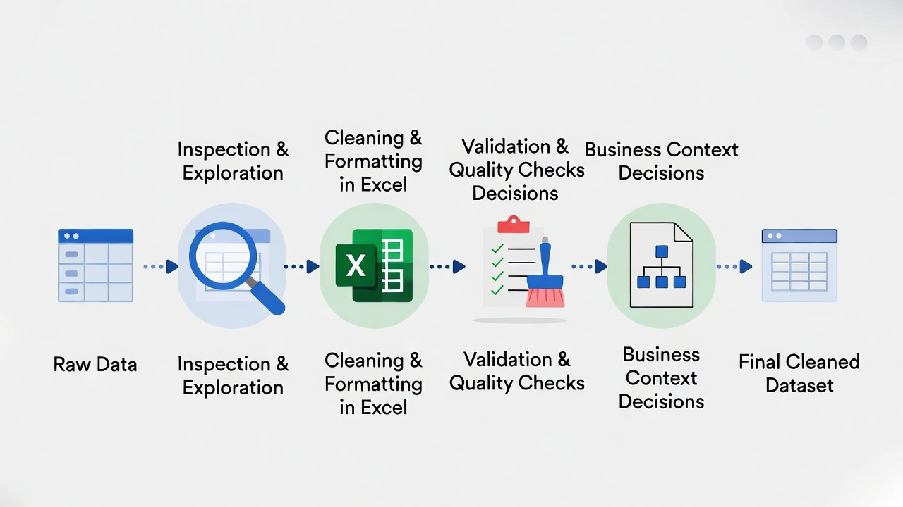
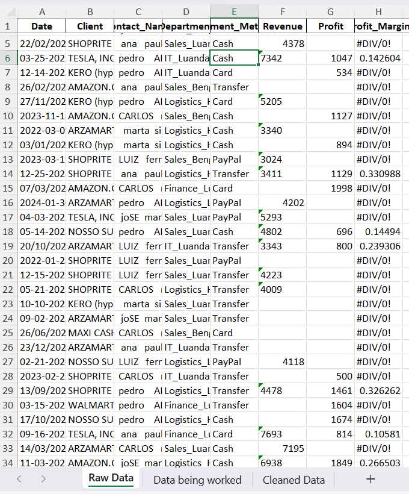
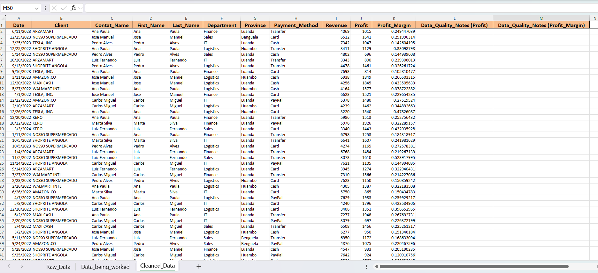

# 📊 Excel Data Cleaning & Formatting  
### Retail Sales Dataset (Angola)

  

---

## 📌 Project Overview

This project demonstrates **professional data cleaning, formatting, validation, and documentation practices** using Microsoft Excel in a retail business context.

> ⚠️ **Data Ethics & Confidentiality Notice**  
> The dataset used in this project was **synthetically and randomly generated for learning and practice purposes only**.  
> Although the company name **ALIMENTA ANGOLA RETAIL, LDA** refers to a real retail operator in Angola, **the data itself is not real** and does not represent actual transactions, customers, or financial records.  
> This approach ensures **ethical use of company names, respect for data confidentiality, and professional integrity**.

The objective of this project is to transform **raw, messy data** into a **clean, structured, and analysis-ready dataset**, while making **business-driven decisions** and clearly documenting data quality limitations.

---

## 🛠 Tools Used

- Microsoft Excel  
- CSV & XLSX file formats  

---

## 📂 Project Structure

---

---

## 🔄 Data Cleaning Workflow

The diagram below summarizes the **end-to-end workflow** followed in this project, from receiving raw data to delivering a clean dataset ready for analysis.

  

> ℹ️ **Workflow Summary**  
> Raw Data → Inspection & Exploration → Cleaning & Formatting → Validation & Quality Checks → Business Decisions → Data Quality Documentation → Cleaned Dataset

---

## 🧹 Data Cleaning Process

### 1️⃣ Raw Data Inspection

The raw dataset contained multiple data quality issues, including:
- Inconsistent date formats  
- Numbers stored as text  
- Extra spaces and inconsistent casing in names  
- Combined fields (Department + Province)  
- Missing values  
- Calculation errors (`#DIV/0!`)  
- Blank rows and outliers  

📸 **Raw Data Snapshot**  

  

---

### 2️⃣ Data Being Worked On (Exploration & Validation)

During this stage:
- Column widths were autofitted and headers frozen  
- Helper columns were created for analysis  
- Outliers were detected using the **IQR method**  
- Duplicate values were checked  
- Business context was applied before making decisions  

📸 **Outlier Detection & Intermediate Work**  

  

---

### 3️⃣ Cleaned Data (Structured & Standardized)

Key transformations included:
- Standardizing date formats using *Text to Columns*  
- Cleaning and normalizing client and contact names  
- Splitting full names into `First_Name` and `Last_Name`  
- Separating `Department` and `Province` into distinct columns  
- Converting revenue values stored as text into numeric format  
- Removing fully blank rows  

📸 **Cleaned Dataset Overview**  

  

---

### 4️⃣ Data Quality Notes & Business Context

Instead of deleting or guessing missing values:
- Missing **Profit** values were left blank and documented  
- `#DIV/0!` errors in **Profit Margin** were replaced with blanks  
- Dedicated `Data_Quality_Notes` columns explain assumptions and limitations  

📸 **Documented Data Quality Notes**  

  

---

## 💡 Key Business Decisions

- Outliers were retained due to valid retail business scenarios (bulk purchases)  
- Missing Profit values were not imputed to avoid misleading conclusions  
- Profit Margin was left blank when Revenue or Profit was missing  
- Raw, working, and cleaned datasets were kept separate for auditability  

---

## ✅ Final Output

- Cleaned Excel dataset ready for analysis  
- Cleaned CSV dataset for SQL, Power BI, or Python  
- Transparent documentation of data quality assumptions  

---

## 🚀 Skills Demonstrated

- Excel data cleaning & formatting  
- Business-context decision making  
- Data validation and quality checks  
- Ethical handling of synthetic data  
- Professional documentation and workflow design  

---

## 📌 Notes

> 🎓 **Internship Context**  
> This project was completed as part of a **Data Analytics Internship task** and is suitable for use as:
> - A portfolio case study  
> - A GitHub project  
> - Supporting material for resumes, LinkedIn, and freelance platforms  

---

